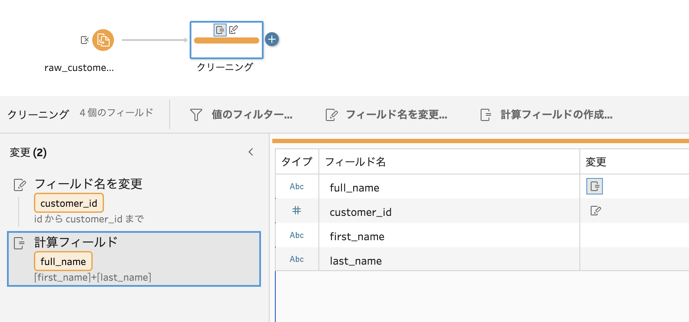
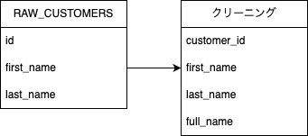

カラム定義の計算
******************************************************

グラフ化されたフローから、各ステップでのカラム定義が計算されます。

カラム定義とは
====================

たとえば、以下のようにクリーニングステップで列名が変更されている場合を考えます。

  
この場合、各ステップではカラムは以下のような状態を持っていると言えます。

  
このような、親から子に対して引き継がれ、子のもつ操作によって更新されていくカラムの状態を、 ``カラム定義`` と呼ぶことにします。

計算方法
====================

グラフ化されたノードを、依存関係順に並び替え（トポロジカルソート）を行い、上流レイヤーから順番に計算し、結果を下流へ伝播させます。

各ステップの種類ごとの計算ロジックは、:doc:`/converters/converters_index` を参照してください。

カラム定義が計算できなかったとき
==================================

変換時、カラム定義の計算に失敗することがあります。

たとえば、フローをTableau Prepで開いたとき、ネットワークやアクセス権限の問題などでデータソースが読み取れなかったとします。
この状態でエクスポートしたフローの定義ファイルには、ソースのカラム情報が記録されないことがあります。
このフローファイルを用いると、源泉データのカラムが不明のため、下流もカラム定義が計算できません。
その他、本ツールでは変換仕様が未実装のステップを見つけたときにも、カラム定義の計算ができないため、不明として扱われます。

基本的には、上流のカラム定義が不明だった場合には、その下流のカラム定義も不明として扱われます。