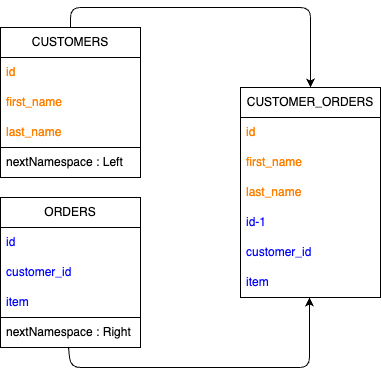

SuperJoin（結合）
******************************************************

`結合ステップ <https://help.tableau.com/current/prep/ja-jp/prep_combine.htm>`_ 
の変換仕様です。

フロー定義フォーマット
========================================

.. code-block:: json

    {
      "nodeType" : ".v2018_2_3.SuperJoin",
      "name" : "結合",
      "id" : "d7c4fbab-1c11-4e48-bea8-b9c4ab4fa19f",
      "baseType" : "superNode",
      "nextNodes" : [ {
        "namespace" : "Default",
        "nextNodeId" : "aec350a4-4f33-46c5-92b5-db7f93e6cf9f",
        "nextNamespace" : "Default"
      } ],
      "serialize" : false,
      "description" : null,
      "beforeActionAnnotations" : [ ],
      "afterActionAnnotations" : [ ],
      "actionNode" : {
        "nodeType" : ".v1.SimpleJoin",
        "name" : "結合",
        "id" : "5f18418f-ba28-45ee-bf31-bc638d2c43f4",
        "baseType" : "transform",
        "nextNodes" : [ ],
        "serialize" : false,
        "description" : null,
        "conditions" : [ {
          "leftExpression" : "[CUSTOMER_ID-1]",
          "rightExpression" : "[CUSTOMER_ID]",
          "comparator" : "=="
        } ],
        "joinType" : "left"
      }
    }

グラフへの変換
========================================

``nextNodes`` 属性から、次のステップへの参照を取得し、エッジを構築します。

カラム定義の計算
========================================

親ステップのもつカラムから計算します。親ステップのカラム定義が不明の場合、自身も不明として扱います。

親ステップは２つあり、それぞれが ``nextNodes.nextNamespace`` 属性に ``Left`` か ``Right`` の名前を持っています。
nextNamespaceが ``Left`` のステップがもつカラムと、 ``Right`` のステップがもつカラムの和を計算します。
ただし、同名のカラムが両方に含まれた場合には、 ``Right`` のカラムを ``"<カラム名>-1"`` へリネームします。

  
SQLへの変換
========================================

:doc:`/convert_subcommand/sqls` の通り、共通のCTE文作成が行われます。前処理と後処理の間に、
以下の通り集計用のCTE文が作成されます。

.. code-block:: json

   "actionNode" : {
        "nodeType" : ".v1.SimpleJoin",
        "name" : "結合",
        "id" : "5f18418f-ba28-45ee-bf31-bc638d2c43f4",
        "baseType" : "transform",
        "nextNodes" : [ ],
        "serialize" : false,
        "description" : null,
        "conditions" : [ {
          "leftExpression" : "[CUSTOMER_ID-1]",
          "rightExpression" : "[CUSTOMER_ID]",
          "comparator" : "=="
        } ],
        "joinType" : "left"
      }

.. code-block:: sql+jinja

    WITH "left" as (
        -- beforeActionAnnotationsの処理
    ),
    "right" as (
        -- beforeActionAnnotationsの処理
    ),
    "<ノードID>" as (
        SELECT
            "ID"
            , MAX("ORDERS") AS "ORDERS"
        FROM
            "left" LEFT OUTER JOIN "right"
            ON "left"."[CUSTOMER_ID-1]" = "right"."[CUSTOMER_ID]"
    ),
    "xxx" as (
        -- afterActionAnnotationsの処理
    )

Tableau Prepでの結合タイプとSQLの結合条件の変換対応は以下の通りです。

内部
----------------------------

.. code-block:: sql+jinja

  from
    left_table inner join right_table

左
----------------------------

.. code-block:: sql+jinja

  from
    left_table left outer join right_table

左（不一致のみ）
----------------------------

.. code-block:: sql+jinja

  from
    left_table left outer join right_table
    on left_table.key = right_table.key
  where
    right_table.key is null

右
----------------------------

.. code-block:: sql+jinja

  from
    right_tale left outer join left_table

右（不一致のみ）
----------------------------

.. code-block:: sql+jinja

  from
    right_table left outer join left_table
    on left_table.key = right_table.key
  where
    left_table.key is null

完全外部
----------------------------

.. code-block:: sql+jinja

  from
    left_table full outer join right_table

不一致のみ
----------------------------

.. code-block:: sql+jinja

  from
    left_table full outer join right_table
    on left_table.key = right_table.key
  where
    left_table.key is null
    or right_table.key is null

また、結合条件の式の対応は、以下の通りです。

.. table:: 
    :align: left

    =================== =====================
    Tableau上の式        変換後のSQL
    =================== =====================
    '=='                =    
    '!='                !=       
    '>'                 >       
    '>='                >=       
    '<'                 <
    '<='                <=
    =================== =====================