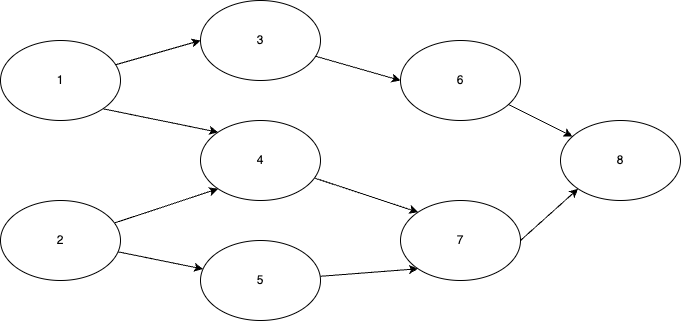
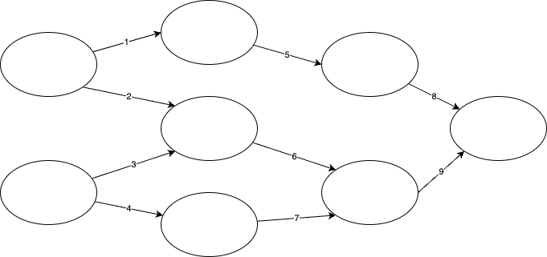
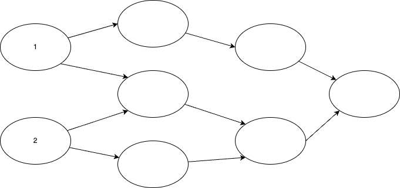
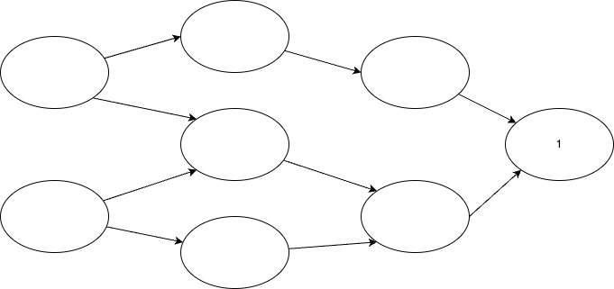
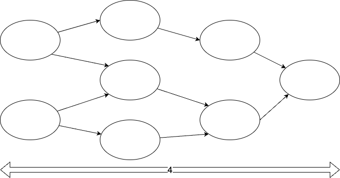
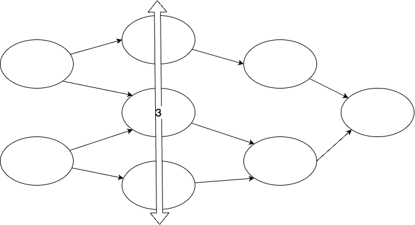
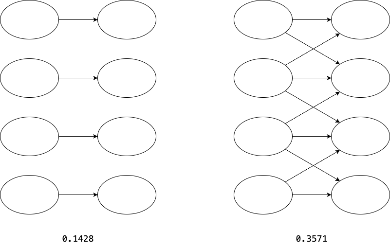
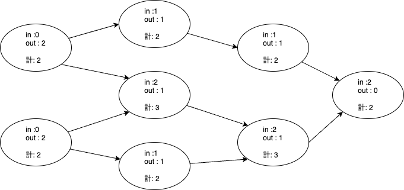
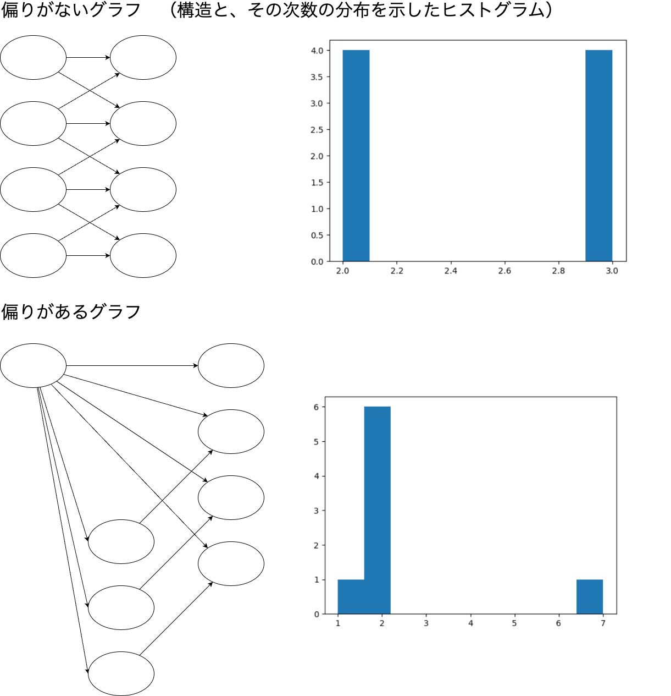

統計情報の出力
######################################################

導入
******************************************************

Tableau Prepからdbtへ移行を行うにあたり、事前に移行の難易度測定や規模の見積もりを行いたくなることがあります。
このツールは、フローが使用している機能や、規模、処理の複雑さを示すメトリクスを計算します。

各メトリクスの意味
******************************************************
  
ノード数
======================================================

総ステップ数です。

例： ノード数 = 8

エッジ数
======================================================

ステップ間の接続の本数です。

例： エッジ数 = 9

入力ノード数
======================================================

フローのうち、親を持たないノードの総数です。つまり、データソース接続の総数です。

例： 入力ノード数 = 2

出力ノード数
======================================================

フローのうち、子を持たないノードの総数です。つまり、出力ステップの総数です。

例： 出力ノード数 = 1

深さ
======================================================

入力から出力までの流れのうち、最も長いパスの距離です。つまり、ステップを実行順にならべたときの、レイヤーの数です。

例： 深さ = 4

幅
======================================================

ステップを実行順にならべたときの各レイヤーのうち、もっとも多くステップを含むレイヤーのステップ数です。

例： 幅 = 3

密度
======================================================

各ステップからすべてのステップとの間にエッジを張った場合の本数に対する、実際にエッジが存在する割合です。

密度を計算すると、左は ``0.1428`` 、右は ``0.3571`` となります。密度の高いネットワークでは、
密度の低いネットワークよりもデータの依存が拡散しているため、処理が複雑になっている可能性が高いです。

平均次数
======================================================

ステップが他のステップと接続している本数の平均です。

平均次数が高いグラフはデータ同士の依存が多いため、処理が複雑になっている可能性が高いです。

エントロピー
======================================================

.. note:: 

  エントロピーから読み取れる情報が乏しそうなので、現在エントロピーの計算はコメントアウトしています。
  もし使いたい場合は、コメントインして利用ください。

グラフの次数の分布を用いて計算したシャノンエントロピーです。
各ステップの次数の出現確率を情報量として計算し、その平均情報量を求めます。

エントロピーが高いグラフでは、エントロピーが低いグラフに比べて、次数が偏っているといえます（よく利用されているステップと、利用されていないステップの差がある状態です）。

たとえばこの図ようなグラフを考えます。

上下のグラフはノード数、エッジ数ともに同数です。

ただ、上のグラフは次数2のノードと3のノードを同数持つ偏りがない状態である一方、
下のグラフでは次数が2のノードがほとんどですが、ひとつだけ次数が7のノードがある偏った状態です。

両者のエントロピーは、 ``1.0`` と ``1.061`` となり、偏りのある方が大きな数値になります。