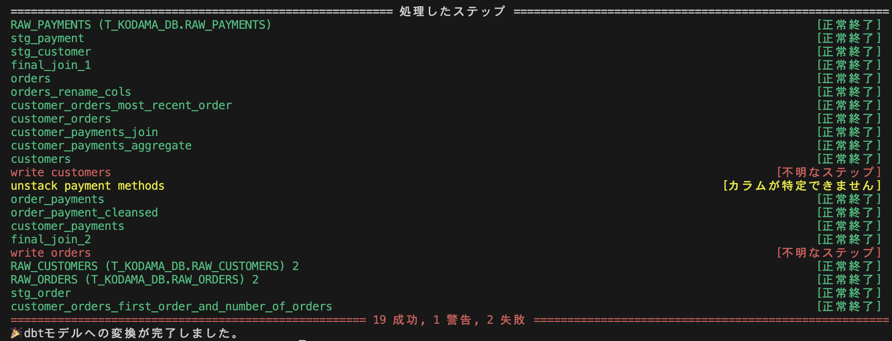
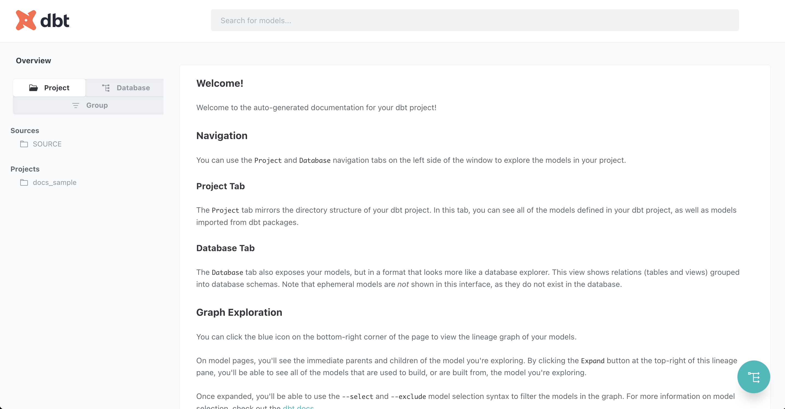
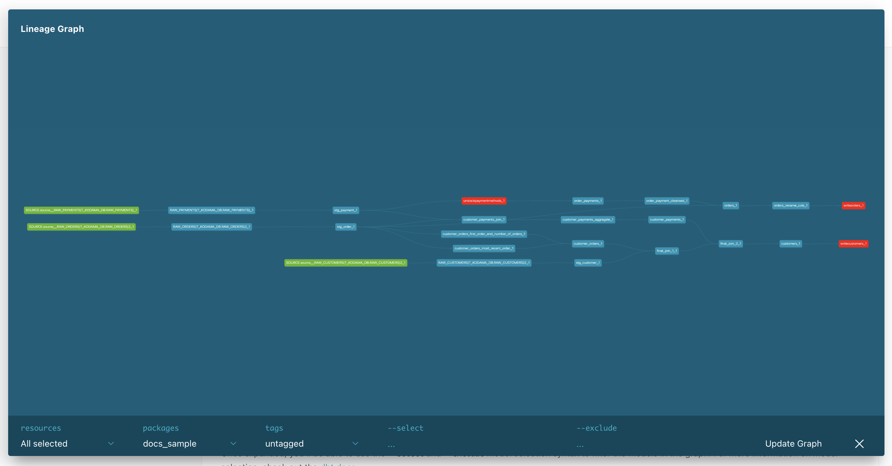
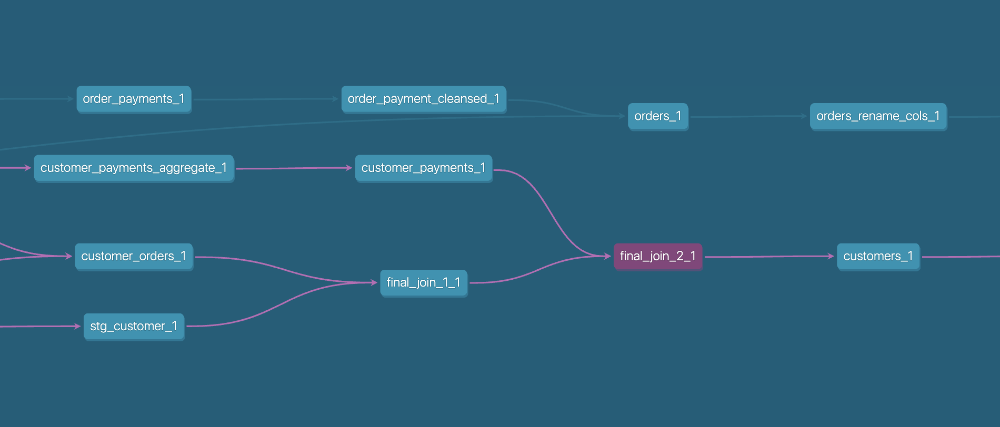
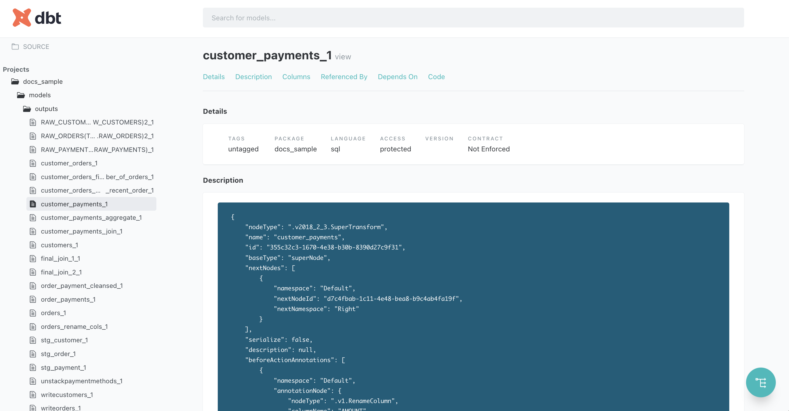
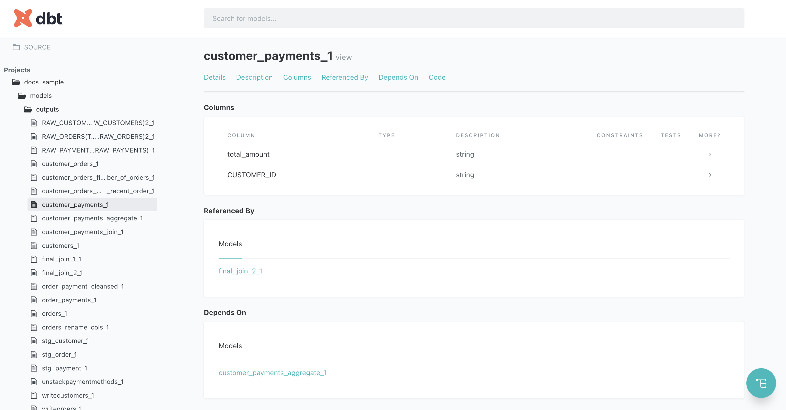
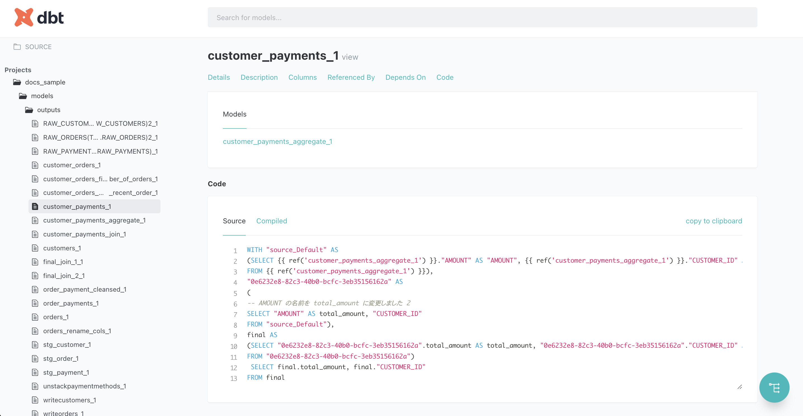

クイックスタート
######################################################

prep2dbtを使い始めるには、Pythonとpipが必要です。
すでにセットアップされている場合は、 :ref:`prep2dbtのインストール<prep2dbtinstall>` までスキップしてください。

Pythonのインストール
******************************************************

OSに合わせて、Pythonをインストールします。ツールが対応しているpythonバージョンは、:doc:`requirements_and_install` を確認してください。

多くの場合、Pythonのインストールによってpipも一緒にインストールされますが、もし導入されていない場合は合わせてインストールしてください。

.. _prep2dbtinstall:

prep2dbtのインストール 
******************************************************

ツールはpipを使ってインストールできますが、仮想環境を利用することを推奨します。ここでは ``pipenv`` を用います。

.. code-block:: shell

  $ pip install pipenv
  $ pipenv install prep2dbt

フローファイルのエクスポート
******************************************************

変換したいTableau Prepフローを、ファイルとしてエクスポートします。
ファイルの詳細および最新の情報については `Tableau公式ドキュメント <https://help.tableau.com/current/prep/ja-jp/prep_save_share.htm>`_ を確認してください。

#. 変換したいフローをTableau Prep上で開きます。
#. 「ファイル」 → 「ダウンロード」を選択し、フローをファイルとして保存します。

    .. image:: images/quickstart/export_flow_file_from_prep.png
      :scale: 50
      :align: center

変換の実行
******************************************************

コマンドラインから、変換後のファイルを置きたいディレクトリへ移動して、ツールを実行します。

.. code-block:: shell

  $ prep2dbt convert -f /path/to/flow_file.tfl

.. tip:: 

  変換後のファイルをおくディレクトリは、ワークディレクトリ以外にも指定が可能です。

  指定できるオプションは、 :doc:`command_usage` を参照してください。

実行されると、以下のような出力とともに、``outputs`` フォルダへSQLとYMLファイルが作成されているはずです。

.. code-block:: shell

  ================================== 処理したステップ ==================================
  RAW_PAYMENTS (RAW_PAYMENTS)                                                 [正常終了]
  stg_payment                                                                 [正常終了]
  stg_customer                                                                [正常終了]
  final_join_1                                                                [正常終了]
  orders                                                                      [正常終了]
  orders_rename_cols                                                          [正常終了]
  customer_orders_most_recent_order                                           [正常終了]
  customer_orders                                                             [正常終了]
  customer_payments_join                                                      [正常終了]
  customer_payments_aggregate                                                 [正常終了]
  customers                                                                   [正常終了]
  write customers                                                        [不明なステップ]
  unstack payment methods                                         [カラムが特定できません]
  order_payments                                                              [正常終了]
  order_payment_cleansed                                                      [正常終了]
  customer_payments                                                           [正常終了]
  final_join_2                                                                [正常終了]
  write orders                                                           [不明なステップ]
  RAW_CUSTOMERS (RAW_CUSTOMERS) 2                                             [正常終了]
  RAW_ORDERS (RAW_ORDERS) 2                                                   [正常終了]
  stg_order                                                                   [正常終了]
  customer_orders_first_order_and_number_of_orders                            [正常終了]
  ============================== 19 成功, 1 警告, 2 失敗 ===============================
  🎉dbtモデルへの変換が完了しました。

変換が完了したことがわかります。
表示されている各行は、Prepに含まれるそれぞれのステップに対して、
どういった変換が行われたかを示しています。

不明なステップ
====================
赤文字で表示される「不明なステップ」ステータスは、該当ステップの種類の変換仕様が本ツールでサポートされていなかったことを示します。

変換仕様が特定できなかったステップは、最低限のSQLを生成するように処理をフォールバックします。（以下のサンプルのように、参照元テーブルのすべての列を取得するだけのSQLが作成されます。）

.. code-block:: sql+jinja

  WITH final AS 
  (
  -- このステップは変換仕様が未実装です。 write customers
    SELECT * 
    FROM {{ ref('customers_1') }} AS source
  )
  
  SELECT * 
  FROM final

カラムが特定できません
========================================

黄色文字で表示される「カラムが特定できません」ステータスは、変換仕様は特定できたものの、
参照元のステップが「不明なステップ」になっているなどの理由で、どのようなカラムが入力されるのか特定できなかったことを示します。

このステータスのステップでは、できる限りカラム定義を推測して変換を行いますが、不明な場合は ``"*"`` でクエリするようなSELECT文を作成します。

正常終了
====================

緑文字で表示される「正常終了」ステータスは、変換仕様が見つかり、カラム定義も特定できたことを示します。

dbtプロジェクトの作成
******************************************************

変換したモデルをdbtプロジェクトへ取り込みます。既存のdbtプロジェクトへモデルを取り込む場合は、までスキップしてください。

dbtのインストール
====================

まずはローカルで、とりあえずdbtに取り込んでドキュメント化機能などを確認したいだけなら、 ``duckDB`` 向けにプロジェクトを作れれば十分です。

``dbt-duckdb`` をインストールします。

.. code-block:: shell

  $ pipenv install dbt-duckdb

プロジェクトの構築
====================

``dbt init`` コマンドで、プロジェクトを作成します。プロジェクト名は、 ``prep_to_dbt`` とします。

.. code-block:: text

  $ pipenv run dbt init -s

  08:54:16  Running with dbt=1.7.4
  Enter a name for your project (letters, digits, underscore): prep_to_dbt
  08:54:21  
  Your new dbt project "prep_to_dbt" was created!

  For more information on how to configure the profiles.yml file,
  please consult the dbt documentation here:

    https://docs.getdbt.com/docs/configure-your-profile

  One more thing:

  Need help? Don't hesitate to reach out to us via GitHub issues or on Slack:

    https://community.getdbt.com/

  Happy modeling!

ワークディレクトリ配下に、以下の構造が作られたことを確認してください。
``models/example`` フォルダは、削除しても構いません。

::

  prep_to_dbt
  ├── README.md
  ├── analyses
  ├── dbt_project.yml
  ├── macros
  ├── models
  │   └── example
  │       ├── my_first_dbt_model.sql
  │       ├── my_second_dbt_model.sql
  │       └── schema.yml
  ├── seeds
  ├── snapshots
  └── tests

プロファイルの追加
====================

プロファイルは、dbtがデータベースへ接続するために使用する資格情報などを定義したものです。
``profiles.yml`` を、 ``dbt_project.yml`` と同じディレクトに作成し、以下の内容で保存します。

::

  prep_to_dbt
  ├── README.md
  ├── analyses
  ├── dbt_project.yml
  ├── macros
  ├── models
  ├── profiles.yml  <-- 追加
  ├── seeds
  ├── snapshots
  └── tests

.. code-block:: yaml
  :caption: profiles.yml

  prep_to_dbt:
    outputs:
      dev:
        type: duckdb
    target: dev

これでプロジェクトの構築は完了です。

変換されたフローをdbtプロジェクトへ取り込む
******************************************************

ワークディレクトリ配下に作られた ``outputs`` ディレクトリを、dbtプロジェクトの ``models`` へ追加します。それだけです。

::

  prep_to_dbt
  ├── README.md
  ├── analyses
  ├── dbt_project.yml
  ├── macros
  ├── models
  │   └── outputs   <-- 追加
  ├── profiles.yml
  ├── seeds
  ├── snapshots
  └── tests

dbt docsの生成と公開
******************************************************

dbtは、ymlに記述された情報とSQLの依存関係から、データパイプラインのドキュメントを自動作成します。

プロジェクトのルートディレクトリで、以下のコマンドを実行して生成できます。

.. code-block:: shell

  $ dbt docs generate

生成されたドキュメントを確認するには、以下のコマンドです。

.. code-block:: shell

  $ dbt docs serve

ローカルで、ドキュメントを公開する軽量なWebサーバが立ち上がり、ブラウザでdbt docsの画面が開いたはずです。

右下の青緑のフローティングアイコンを押すと、変換されたモデルのリネージグラフが表示されます。

モデルの色の意味は以下の通りです。
  - 緑のモデル
    
    データの源泉となっているsourceです。

  - 赤のモデル

    変換時、「不明なステップ」として処理されたモデルです。

  - 青のモデル

    「正常終了」または「カラムが特定できません」として処理されたモデルです。

モデルを選ぶと、そのモデルが依存している上流モデルと、参照されている下流モデルまでが色付けされ、Prepよりも素早く依存を辿ることができます。

次に、それぞれのモデルの詳細ページを開いてみます。

  
descriptionでは、フローファイルから抽出した、ステップの定義情報が記述されます。

  
columnsには、カラム定義の計算ができた場合は、その情報が記述されます。

  
また、変換済みSQLも参照ができます。

これらの説明は、ymlファイルを更新することで自由に変更が可能です。

次のステップへ
******************************************************

より高度なdbtの利用方法は、`dbt公式のガイド <https://docs.getdbt.com/>`_ から入手できます。

もし手元のフローで使っているステップが本ツールの変換仕様で未対応でしたら、:doc:`/develop_guide` より、カスタム定義を追加する方法を確認してみてください。